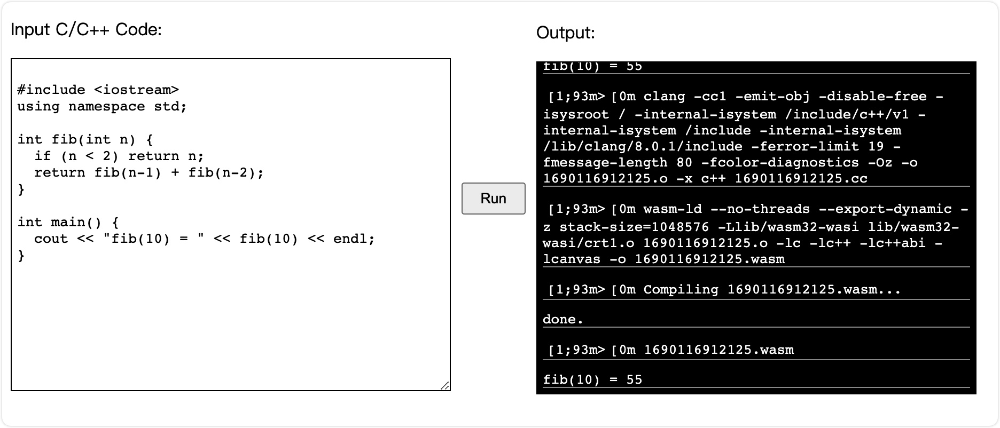

<div align="center">
  <h1 align="center">Clang.js</h1>
  <h3 align="center">Run C/C++ in the Browser.</h3>
</div>

## Overview



This repo is extending the great work from [Ben Smith](https://twitter.com/binjimint) [published in his CppCon 2019 WebAssembly talk](https://www.youtube.com/watch?time_continue=4&v=5N4b-rU-OAA). The WebAssembly binaries are copied from Ben's fork of [llvm-project](https://github.com/binji/llvm-project/releases).

## Installation

```bash
# NPM
npm install clang.js

# Yarn
yarn add clang.js
```

## Usage

```typescript
import { init, run } from 'clang.js';

async function main() {
  await init({
    // The path to the wasm resources
    path: 'https://cdn.jsdelivr.net/npm/clang.js/dist',
  });

  const code = `
    #include <iostream>
    using namespace std;

    int fib(int n) {
      if (n < 2) return n;
      return fib(n-1) + fib(n-2);
    }

    int main() {
      cout << "fib(10) = " << fib(10) << endl;
    }`;
  
  run(code);
}

main();
```

## License

Apache-2.0
